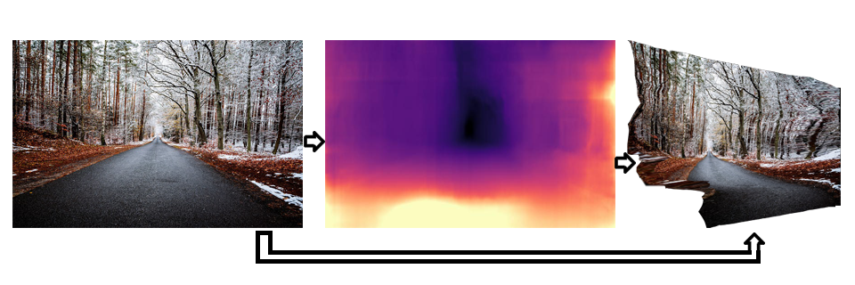
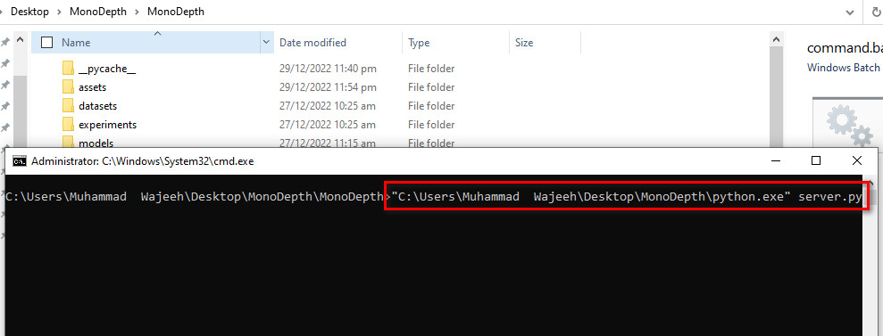
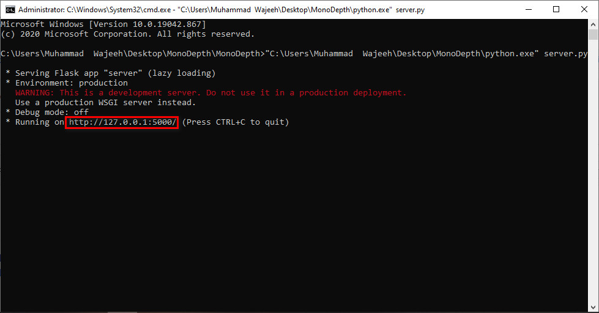
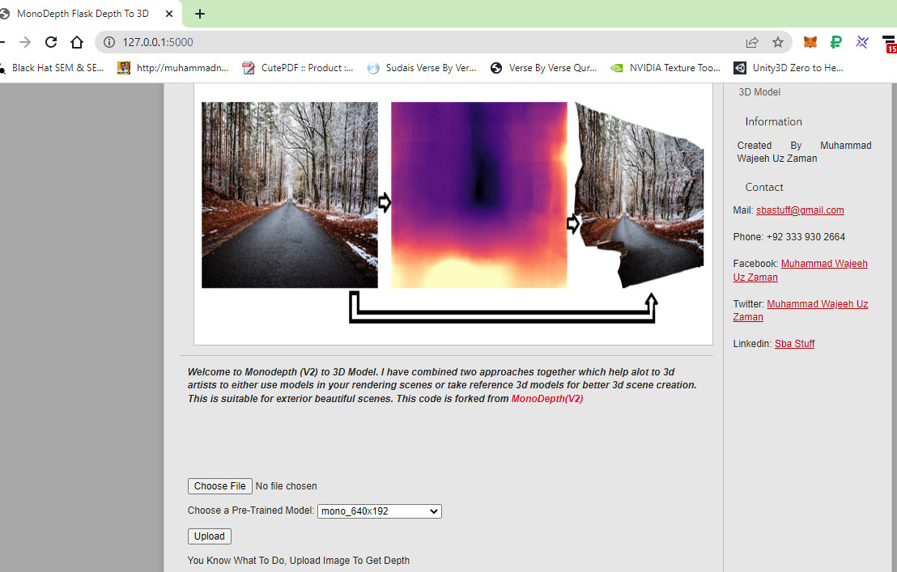
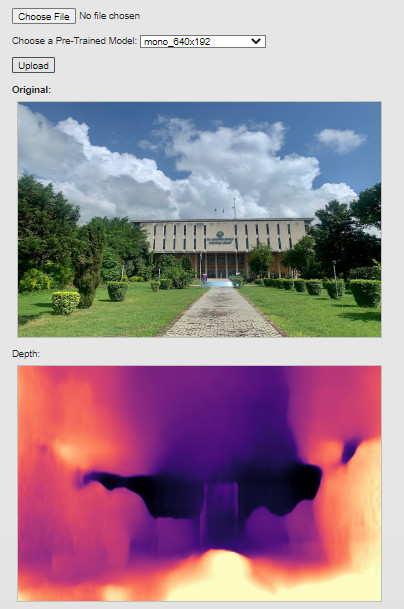
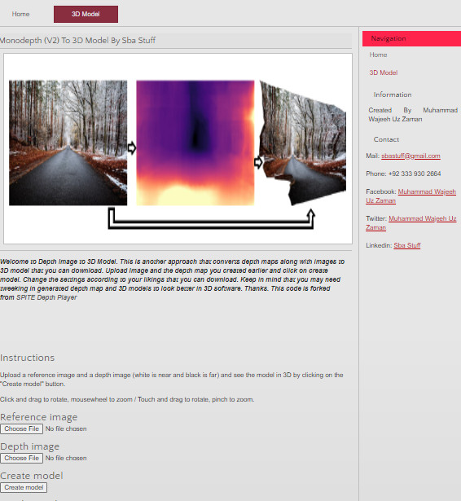
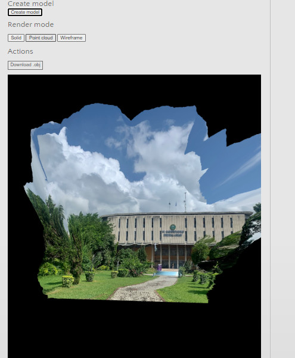

# Monodepth Image To 3D Model

It is a flask based web app to create 3d models from depthmaps. You can create depthmaps and 3d models in the same app. I used [monodepth(V2)](https://github.com/nianticlabs/monodepth2) and [Depth Player](https://github.com/spite/depth-player) for this. (Don't Sue Me On Modifications Please)


<p align="center">
  
</p>

This code is for non-commercial use; please see the [license file](LICENSE) for terms.

If you find our work useful in your research please consider citing our paper:

```
@article{MonoDepthImageTo3DModel,
  title     = {Monodepth Image To 3D Model},
  author    = {Muhammad Wajeeh Uz Zaman and
  source = {[Github Implementation](https://github.com/Sba-Stuff/Monodepth-Image-To-3D-Model/)},
  month = {January},
year = {2023}
}
```


## ⚙️ Setup
Follow Same steps by [Monodepth V2 Author](https://github.com/nianticlabs/monodepth2)

## 🖼️ Prediction for a single image

You can predict scaled disparity for a single image with:

```shell
python test_simple.py --image_path assets/test_image.jpg --model_name mono+stereo_640x192
```

or, if you are using a stereo-trained model, you can estimate metric depth with

```shell
python test_simple.py --image_path assets/test_image.jpg --model_name mono+stereo_640x192 --pred_metric_depth
```

Download models and extract in appropriate directories (models/ folder). Overwrite directories if required. Github doesn't allowed me to upload files more than 25 mb. So download models from table below and extract in appropriate directories and overwrite when asked.

On its first run either of these commands will download the `mono+stereo_640x192` pretrained model (99MB) into the `models/` folder.
We provide the following  options for `--model_name`:

| `--model_name`          | Training modality | Imagenet pretrained? | Model resolution  | KITTI abs. rel. error |  delta < 1.25  |
|-------------------------|-------------------|--------------------------|-----------------|------|----------------|
| [`mono_640x192`](https://storage.googleapis.com/niantic-lon-static/research/monodepth2/mono_640x192.zip)          | Mono              | Yes | 640 x 192                | 0.115                 | 0.877          |
| [`stereo_640x192`](https://storage.googleapis.com/niantic-lon-static/research/monodepth2/stereo_640x192.zip)        | Stereo            | Yes | 640 x 192                | 0.109                 | 0.864          |
| [`mono+stereo_640x192`](https://storage.googleapis.com/niantic-lon-static/research/monodepth2/mono%2Bstereo_640x192.zip)   | Mono + Stereo     | Yes | 640 x 192                | 0.106                 | 0.874          |
| [`mono_1024x320`](https://storage.googleapis.com/niantic-lon-static/research/monodepth2/mono_1024x320.zip)         | Mono              | Yes | 1024 x 320               | 0.115                 | 0.879          |
| [`stereo_1024x320`](https://storage.googleapis.com/niantic-lon-static/research/monodepth2/stereo_1024x320.zip)       | Stereo            | Yes | 1024 x 320               | 0.107                 | 0.874          |
| [`mono+stereo_1024x320`](https://storage.googleapis.com/niantic-lon-static/research/monodepth2/mono%2Bstereo_1024x320.zip)  | Mono + Stereo     | Yes | 1024 x 320               | 0.106                 | 0.876          |

Use seperate models for better results.

## Flask Based Web Server Instructions

Run Using python using command

```shell
python.exe server.py
```
<p align="center">
  
</p>

Copy url and paste in browser. "Mostly its:

<p align="center">
  
</p>

```shell
127.0.0.1:5000
```

<p align="center">
  
</p>

Generate depth maps by uploading images. Make sure to save depthmaps.
<p align="center">
  
</p>

Generate 3D models by uploading images and depthmaps and clicking on Create Model in 3D Model Menu.
<p align="center">
  
</p>

Use settings and hit again on Create Model for better modifications in 3D Model. Click On download obj to download model. Play with different parameters given for different results.
<p align="center">
  
</p>

Tutorial is presented in video.

##Tutorial Video
System is slow, plus I am no experienced yet well in video editing, fast forward where required. Thanks.

## 👩‍⚖️ License
Copyright © MrMWUZ. 2022. All rights reserved.
Please see the [license file](LICENSE) for terms.
